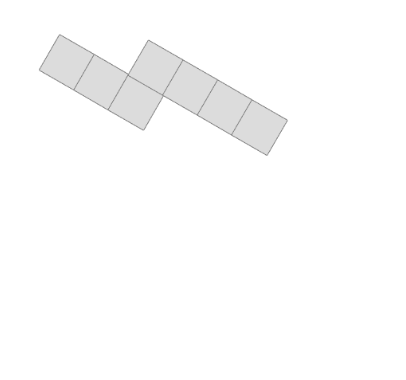
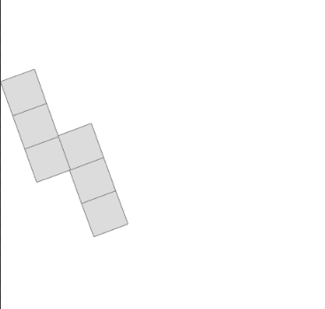

# serre

## What is this?
This is my repo to generate training data for the network for Lakshmi! For the [2D stimuli](#2D-section), each stimulus is a single image of a rotated polyomino. For [3D stimuli](#3D-section), each stimulus is a video in the format of `blank screen (1s) --> object (2s) --> blank screen (1s) --> object (2s)`.

# 2D STIMULI

### How do I run this?
The 2d stimulus generation file is `gen_2d_simple.py`. `gen_2d.py` is its older and lesser cousin.

1) If you have not already, you will need to download OpenCV (I used `pip`). There may be other things you have to install, but I can't remember off the top of my head and I'm sure your terminal will let you know.

2) There is currently one flag, which is `vol`, which stands for the number of random images you would like to generate.   

For reference, here is what a polyomino with leg lengths `3 0 4` would look like:

  

  

In order to generate the above sample image, I ran `python3 gen_2d_simple.py -- --vol 1`.

For every newly generated stimulus, two main categories are randomized: 1) the number of blocks in each leg and 2) theta (degree of rotation). Every polyomino is centered and has the same side length of 8. The canvas is always 64 x 64 and the number of blocks in each leg never exceeds 5. 

It is set up so that if you do not have an `output` folder already, it creates it for you. If you already have it, it will erase everything you have in it and start over. In case we want to just keep accumulating data, I can of course change this. Each output image is named in the format `{leg1 len}_{leg2 len}_{leg3 len}_{theta}`. This is because of the `2d_sample.py` file!

The `2d_sample.py` file has the flag `sample` with options 1, 2, and 3. Each option returns the matrix representations of two images pulled from the generated dataset. For option 1, the two stimuli are exactly the same. For 2, the stimuli have the same leg lengths but different theta. For 3, you get two stimuli with different leg lengths and different rotation angles.

### Important Notes + Running List of Questions/Flaws
1) I'm using the OpenCV `fillPoly` command in order to shade each square of the shape, but this is causing slight displacement in the middle leg - need to figure out why this is the case and fix it
2) Need to put in assertions for user input in flags - I can do this fairly quickly once we nail down the specifications!

  

As you can probably see, one of the corners is right on the edge of the canvas - this is because I find the maximum translation (horz and vert) needed to get the entirety of the shape in the frame and then shift shape accordingly by that exact amount. If this looks weird, I can definitely work in logic so there's some extra padding around the shape.

# 3D STIMULI 

### How do I run this?

The 3d stimulus generation file is `gen_3d.py`.

1) Open terminal from somewhere you can run Blender from - I personally set a path so I can run it just using the `blender` command. I did so by following this [link](https://docs.blender.org/manual/en/latest/advanced/command_line/launch/macos.html).

2) There are currently two flags: `--number` to specify the number of stimuli you want to generate, and `--save` to detail the folder you want to save said outputs in relative to your working directory.

Here is an example of something I would run from my terminal to generate 2 stimuli videos and save them in my output folder:

`blender -b -P Documents/workspace/serre/gen.py -- --number 2 --save Documents/workspace/serre/output`

I recommend you open the output videos in VLC, just because they wont open with QuickTime Player.

### I ran the code, but what are all these extra output files?
The **real** final output videos will look something like `out1.mp4` or `out2.mp4` - at this point, you very likely have correctly guessed that the file name is "out" + a counter! But what are these other output files? I shall explain!

`blank.png` is a control image of sorts, just saving a blank canvas of a Blender environment. This is what is used as the buffer screen before each rotated image in the stimulus. It only needs to be generated once.

`image1.png` and `image2.png` are the frames for the first and second rotations. These two filenames are used and overwritten every single time you need to generate the images for a new stimulus video.

`a.mp4`, `b.mp4`, `c.mp4`, and `d.mp4` are the 4 subsections of the video that become directly stitched together in order to make the final output video. These are also overwritten every time you create a new stimulus. `a.mp4` and `c.mp4` are just the video versions of the `blank.png` image, while `b.mp4` and `d.mp4` are generated from `image1.png` and `image2.png` (respectively). 

In conclusion, the most important products are all the `out%d.mp4` videos, and the other outputs are all just placeholders for the images/video subsections that are generated as intermediary steps. You can (and probably should) just delete these from your output folder once you're done generating the stimuli. Alternatively, I would be happy to adjust the filepathing so that these intermediary products go to a separate folder that has its contents all deleted between iterations. Up to you! I mostly keep them around for debugging purposes.

### Important Notes + Running List of Questions/Flaws
1) I created and ran this on **MacOS**. Adjustments will have to be made for other systems!
2) This runs Blender headless, so you never have to touch the GUI. However, I did include the .blend file I created a while back for my initial scripting for reference.
3) Currently, the choice between showing one object (appearing twice) at different rotations vs two objects (each appearing once) is set randomly - this is subject to change and just a temporary choice I made for the sake of putting out code that showcases the different options for stimuli
4) The two objects in question being used are a monkey head and a cone. The monkey head is the default, as in it is the object used in the case that the stimulus being generated has decided to show one object at two different rotations.
5) Many parts of the code appear redundant for now because I am not sure as to how the requirements of the experiments will change later - therefore, I am leaving it in a way that can accommodate future changes more easily. I am aware it looks ugly :( Just want to wait for more project specifications to finalize before I clean the design. Also, desperately seeking advice for optimizations that would make this less space/time greedy.

### Can I see examples?
`sample_diff.mp4` is an example stimulus in which there are two objects presented, and `sample_same.mp4` is a stimulus with a singular object that is presented twice at different rotations. These are the only two categories of stimulus.
