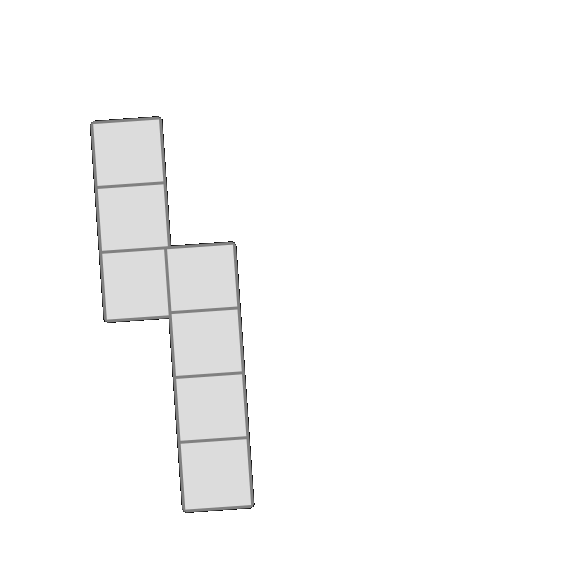

# serre

## What is this?
This is my repo to generate training data for the network for Lakshmi! The repo name is not creative and will be changed later. For the [2D stimuli](#2D-section), each stimulus is a single image of a rotated poly-omino. For [3D stimuli](#3D-section), each stimulus is a video in the format of `blank screen (1s) --> object (2s) --> blank screen (1s) --> object (2s)`.

# 2D STIMULI

### How do I run this?
The 2d stimulus generation file is `gen_2d.py`.

1) If you have not already, you will need to download OpenCV (I used `pip`). There may be other things you have to install, but I can't remember off the top of my head and I'm sure your terminal will let you know.

2) There are currently 2 flags: `--side` takes in a numerical value to specify the side length of the squares that make up the shape and `--legs` takes in an array of 3 integers to indicate the length of each leg of the polyomino. For reference, here is what a polyomino with leg lengths `3 2 4` would look like:

  

If you set leg lengths as `3 2 0`, you will get a two-legged L-shaped figure. **Note**: if you are going to have the first and third legs, you can not set the second leg to a value less than 2 since connecting the first and third legs automatically creates a middle/second leg of length 2 in between them.

In order to generate the above sample image, I ran `python3 gen_2d.py -- --side 65  --legs 3 2 4`.

I haven't set up the output path flag yet, but I anticipate it will be made relatively soon. This script only generates one output image at a time (for now, that is), so once you run it you can expect to see a single new image called `test.png` appear in the same directory from which you ran the script.

### Important Notes + Running List of Questions/Flaws
1) Need to add flag + implementation for whether or not the starting point/center of the shape being created will be in the center of the canvas or a random starting point
2) Need to to add flag for user to set the rotation angle (will be a super duper quick fix, but I just have bigger implementation problems to fix first)
3) [**important**] In order to rotate the shape, I'm rotating the whole canvas and resizing it to ensure that no edges get cut off of the rotated shape. However, this approach is causing inconsistencies in the final rotated shape - the more the shape is rotated, the smaller it ends up being resized. As this could be a confounding factor, this is a very important point to fix.
4) I'm using the OpenCV `fillPoly` command in order to shade each square of the shape, but this is causing slight displacement in the middle leg - need to figure out why this is the case and fix it
5) Rotating the shape makes the lines look jagged, and I'm not sure if this needs to be fixed or not
6) [**important**] Need to work through specifications + edge cases for when the user inputs leg lengths of 0 

# 3D STIMULI 

### How do I run this?

The 3d stimulus generation file is `gen_3d.py`.

1) Open terminal from somewhere you can run Blender from - I personally set a path so I can run it just using the `blender` command. I did so by following this [link](https://docs.blender.org/manual/en/latest/advanced/command_line/launch/macos.html).

2) There are currently two flags: `--number` to specify the number of stimuli you want to generate, and `--save` to detail the folder you want to save said outputs in relative to your working directory.

Here is an example of something I would run from my terminal to generate 2 stimuli videos and save them in my output folder:

`blender -b -P Documents/workspace/serre/gen.py -- --number 2 --save Documents/workspace/serre/output`

I recommend you open the output videos in VLC, just because they wont open with QuickTime Player.

### I ran the code, but what are all these extra output files?
The **real** final output videos will look something like `out1.mp4` or `out2.mp4` - at this point, you very likely have correctly guessed that the file name is "out" + a counter! But what are these other output files? I shall explain!

`blank.png` is a control image of sorts, just saving a blank canvas of a Blender environment. This is what is used as the buffer screen before each rotated image in the stimulus. It only needs to be generated once.

`image1.png` and `image2.png` are the frames for the first and second rotations. These two filenames are used and overwritten every single time you need to generate the images for a new stimulus video.

`a.mp4`, `b.mp4`, `c.mp4`, and `d.mp4` are the 4 subsections of the video that become directly stitched together in order to make the final output video. These are also overwritten every time you create a new stimulus. `a.mp4` and `c.mp4` are just the video versions of the `blank.png` image, while `b.mp4` and `d.mp4` are generated from `image1.png` and `image2.png` (respectively). 

In conclusion, the most important products are all the `out%d.mp4` videos, and the other outputs are all just placeholders for the images/video subsections that are generated as intermediary steps. You can (and probably should) just delete these from your output folder once you're done generating the stimuli. Alternatively, I would be happy to adjust the filepathing so that these intermediary products go to a separate folder that has its contents all deleted between iterations. Up to you! I mostly keep them around for debugging purposes.

### Important Notes + Running List of Questions/Flaws
1) I created and ran this on **MacOS**. Adjustments will have to be made for other systems!
2) This runs Blender headless, so you never have to touch the GUI. However, I did include the .blend file I created a while back for my initial scripting for reference.
3) Currently, the choice between showing one object (appearing twice) at different rotations vs two objects (each appearing once) is set randomly - this is subject to change and just a temporary choice I made for the sake of putting out code that showcases the different options for stimuli
4) The two objects in question being used are a monkey head and a cone. The monkey head is the default, as in it is the object used in the case that the stimulus being generated has decided to show one object at two different rotations.
5) Many parts of the code appear redundant for now because I am not sure as to how the requirements of the experiments will change later - therefore, I am leaving it in a way that can accommodate future changes more easily. I am aware it looks ugly :( Just want to wait for more project specifications to finalize before I clean the design. Also, desperately seeking advice for optimizations that would make this less space/time greedy.

### Can I see examples?
`sample_diff.mp4` is an example stimulus in which there are two objects presented, and `sample_same.mp4` is a stimulus with a singular object that is presented twice at different rotations. These are the only two categories of stimulus.
